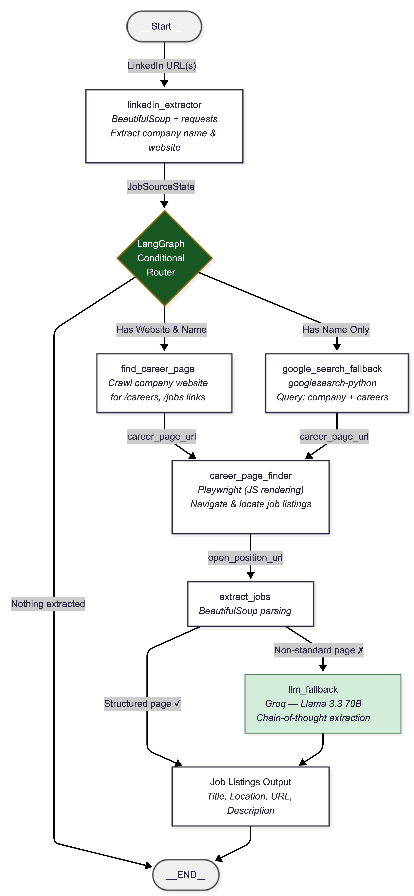
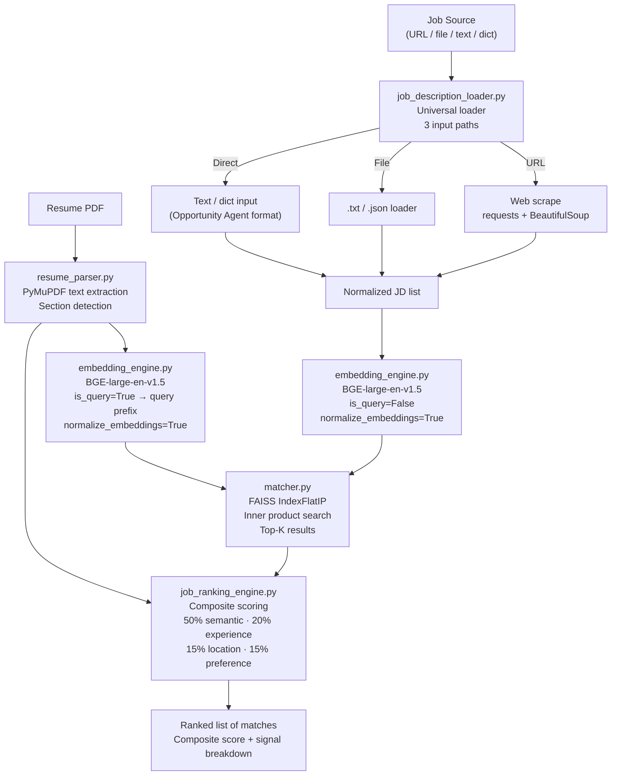
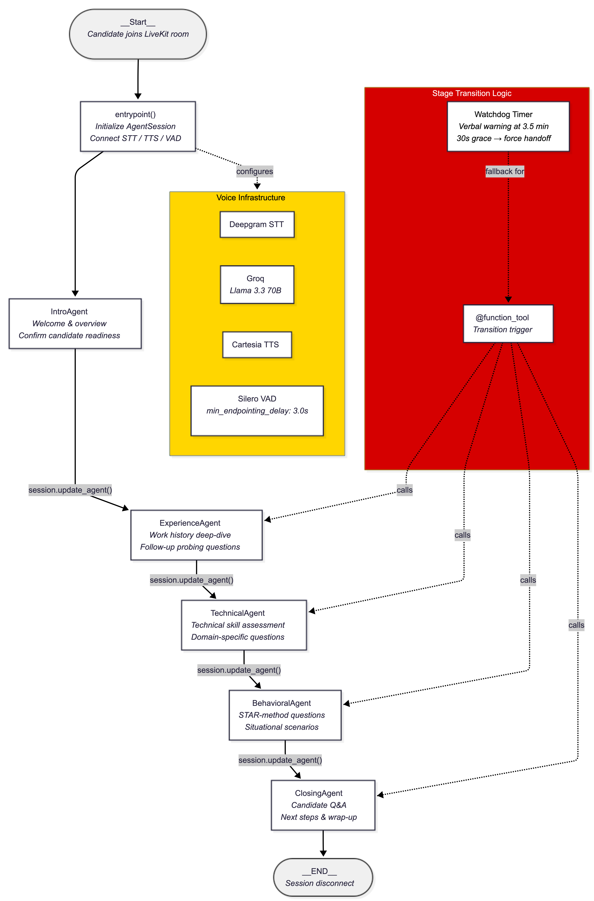

# CareerAgent

**An agentic career intelligence platform that discovers opportunities, matches your resume, tailors your application, and interviews you — so you can focus on the work, not the search.**

---

Most job seekers spend 11 hours a week on applications. They manually browse dozens of career pages. They submit the same resume to every role. They rehearse answers in their head instead of out loud. CareerAgent replaces all of that with AI agents that actually do the work.

---

## The System

CareerAgent is a modular platform where each agent handles one stage of the job search pipeline. Modules work independently or chained end-to-end.

```
LinkedIn Job URL(s)  +  Resume PDF
         │                   │
         ▼                   │
┌─────────────────────────┐  │
│  Opportunity Agent       │  │      Module 1 — Shipped
│  LangGraph pipeline      │  │
│  LinkedIn → company →    │  │
│  career page → job URL   │  │
└───────────┬─────────────┘  │
            │ career page     │
            │ + job URLs      │
            ▼                 ▼
┌─────────────────────────────────┐
│  Resume Matching Agent           │      Module 2 — Shipped
│  BGE-large + FAISS               │
│  Ranks all jobs by semantic      │
│  similarity to your resume       │
│  Returns: top-K ranked matches   │
└───────────┬─────────────────────┘
            │ top-K jobs + resume
            ▼
┌─────────────────────────────────┐
│  Resume Tailor Agent             │      Module 3 — Shipped
│  ATS scoring (heuristic)         │
│  LLM critique (Llama 3.3 70B)    │
│  Targeted suggestions            │
│  Returns: per-job report         │
└───────────┬─────────────────────┘
            │
            ▼
┌─────────────────────────────────┐
│  Interview Agent                 │      Module 4 — Shipped
│  LiveKit voice pipeline          │
│  Multi-stage mock interview      │
│  with LLM-triggered handoffs     │
└─────────────────────────────────┘
```

---

## Modules

### 🔍 Opportunity Discovery Agent `v0.2` — Shipped

An autonomous web agent that takes a LinkedIn job URL and returns structured data: company name, career page URL, and an open position link — navigating JavaScript-heavy sites, ATS platforms, and non-standard layouts without human input.

**How it works:** A LangGraph state machine runs three sequential nodes, each implementing a 4-strategy fallback chain: fast deterministic methods first (URL patterns, regex, meta-tags), then Playwright-based heuristics, then LLM chain-of-thought reasoning, then Google search as a final safety net. The graph has a conditional edge — if LinkedIn extraction finds the company name but not the website, it routes to a Google search node rather than terminating.



**The hard problem it solves:** Company career pages have no standard structure. Some are at `/careers`. Some are buried behind JS-rendered navigation. Some redirect to Greenhouse or Lever with unpredictable URLs. Pure scraping breaks. Pure LLM hallucinates. The layered approach handles both.

| Capability | Implementation |
|---|---|
| Orchestration | LangGraph state machine with conditional edges |
| Web interaction | Playwright for JS-rendered pages |
| LLM reasoning | Groq / Llama 3.3 70B for navigation decisions |
| LinkedIn parsing | 4-layer: JSON-LD → meta-tags → LLM → domain guess |
| Career page discovery | 4-strategy: URL patterns → link scan → LLM → Google |
| Job extraction | ATS-aware regex + Playwright DOM + LLM fallback |

→ [Opportunity Agent README](./opportunity_agent/README.md)

---

### 📄 Resume Matching Agent `v1.0` — Shipped

Semantic job matching: upload your resume PDF, point it at job descriptions from any source, get back the top-K most relevant positions ranked by a composite scoring system. Runs entirely locally — no paid API calls, no data leaving the machine.

**How it works:** The resume PDF is parsed to full text, then encoded as a 1024-dimensional query vector using BGE-large-en-v1.5. Job descriptions are encoded separately as document vectors. FAISS performs exact inner-product search (cosine similarity on L2-normalized vectors) to find the top-K closest jobs. A composite ranking layer then re-scores based on experience fit, location preference, and skill keyword overlap — producing a final ranked list with a full signal breakdown.

#### Mermaid Diagram



**The hard problem it solves:** Keyword matching breaks on synonyms and paraphrasing. "Built recommendation systems with PyTorch" should match "deep learning engineer for personalization" — that requires dense embeddings, not a grep. BGE-large-en-v1.5 is free, local, and ranks competitively on MTEB retrieval benchmarks.

| Capability | Implementation |
|---|---|
| Embeddings | BGE-large-en-v1.5 (HuggingFace, runs locally) |
| Vector search | FAISS IndexFlatIP (exact cosine, in-memory) |
| Resume parsing | PyMuPDF — multi-page PDF to text + section detection |
| JD loading | Universal loader: URL / .txt / .json / dict / raw text |
| Composite ranking | Semantic (50%) + experience (20%) + location (15%) + skills (15%) |

→ [Resume Matching Agent README](./resume_matching_agent/README.md)

---

### ✂️ Resume Tailor Agent `v1.0` — Shipped

Per-job resume intelligence: ATS heuristic scoring, LLM-powered critique, and targeted improvement suggestions — each tailored to a specific job description. Not a rewriter. A precision tool that tells you exactly what to fix and why, role by role.

**How it works:** For each of the top-K matched jobs, three sequential stages run: (1) a deterministic ATS scorer that checks keyword density, section completeness, and formatting signals against the JD, returning a 0-100 score and grade; (2) Groq Llama 3.3 70B identifies the 3-5 most critical weaknesses in the resume for this specific role; (3) the same LLM generates targeted improvement suggestions with example phrasing — but does not rewrite the resume.

**The hard problem it solves:** Generic resume feedback ("add more bullets," "quantify your impact") is useless for a specific application. Useful feedback requires understanding what *this role* demands and measuring the resume against *those* requirements. The hybrid design — deterministic scoring for reproducibility, LLM reasoning for nuance — achieves both.

| Capability | Implementation |
|---|---|
| ATS scoring | Pure Python heuristics — keyword, section, formatting (deterministic) |
| Critique generation | Groq / Llama 3.3 70B — structured JSON output with regex fallback |
| Suggestion generation | Groq / Llama 3.3 70B — "coach, don't rewrite" prompt design |
| Resume parsing | Reuses resume_matching_agent.agents.resume_parser (no duplication) |
| Config | shared/config.py — single GROQ_API_KEY for the monorepo |

→ [Resume Tailor Agent README](./resume_tailor_agent/README.md)

---

### 🎙️ Interview Agent `v0.1` — Shipped

A real-time voice AI that conducts structured mock interviews with multi-stage progression, LLM-driven transitions, and timeout fallbacks.

**How it works:** You join a LiveKit room and start talking. The Intro Agent handles greetings and rapport. When the conversation naturally shifts to experience, the LLM triggers a function tool that hands off to the Experience Agent — same session, no interruption. If you go silent for 4 minutes, a timeout fallback ensures the interview always progresses.



**The hard problem it solves:** Agent-to-agent handoff in voice AI is poorly documented. LiveKit v1.x's `AgentHandoff` API is broken. The solution uses synchronous `session.update_agent()` with function tool triggers — the LLM decides when to transition, the framework executes it cleanly.

| Capability | Implementation |
|---|---|
| Voice pipeline | LiveKit Agents v1.x (STT → LLM → TTS) |
| LLM backbone | Groq / Llama 3.3 70B via OpenAI-compatible endpoint |
| Stage transitions | `@function_tool` triggers with `session.update_agent()` |
| Timeout safety | 4-minute asyncio watchdog → automatic progression |

→ [Interview Agent README](./interview-agent/README.md)

---

## Quickstart

```bash
# Clone and enter the repo
git clone https://github.com/SuyashRoy/career-agent.git
cd career-agent

# Create a single virtual environment for all modules
python -m venv .venv
source .venv/bin/activate  # Windows: .venv\Scripts\activate

# Install all dependencies
pip install -r requirements.txt

# For Opportunity Agent: install Chromium
playwright install chromium

# Configure environment
cp .env.example .env
# Fill in GROQ_API_KEY (required by all LLM-powered modules)
# Fill in LIVEKIT_* keys for the Interview Agent
```

**Run the full Resume pipeline (Matching → Tailor):**
```bash
python -m resume_tailor_agent.pipeline path/to/resume.pdf
# Automatically runs matching agent first, then generates tailoring reports
```

**Run Resume Matching Agent standalone:**
```bash
python -m resume_matching_agent.pipeline path/to/resume.pdf
```

**Run Opportunity Discovery Agent:**
```bash
cd opportunity_agent
python app.py
# Edit test_urls in app.py, or import run_pipeline() as a module
```

**Run Interview Agent:**
```bash
cd interview-agent
python app.py dev
# Open LiveKit Playground → connect to your agent
```

---

## Repo Structure

```
career-agent/
├── opportunity_agent/            # Module 1: Autonomous job discovery
│   ├── agents/
│   │   ├── linkedin_extractor.py      # 4-strategy LinkedIn extraction
│   │   ├── career_page_finder.py      # 4-strategy career page discovery
│   │   └── job_extractor.py           # ATS-aware + LLM job URL extraction
│   ├── models/schemas.py              # Pydantic state + output schemas
│   ├── app.py                         # LangGraph workflow
│   └── README.md
│
├── resume_matching_agent/        # Module 2: Semantic resume-job matching
│   ├── agents/
│   │   ├── embedding_engine.py        # BGE-large wrapper (lazy loading)
│   │   ├── job_description_loader.py  # Universal multi-source JD loader
│   │   ├── matcher.py                 # FAISS index + cosine search
│   │   ├── job_ranking_engine.py      # Composite multi-signal ranking
│   │   └── resume_parser.py           # PyMuPDF PDF parser + section extractor
│   ├── pipeline.py                    # Public API: match_resume_to_jobs()
│   ├── test_data/
│   │   ├── resumes/                   # Sample resume PDFs
│   │   └── job_descriptions/          # Sample JD .txt files
│   └── README.md
│
├── resume_tailor_agent/          # Module 3: Per-job ATS scoring + critique
│   ├── agents/
│   │   ├── ats_scorer.py              # Deterministic ATS scoring (0-100)
│   │   ├── critique_engine.py         # LLM: identify 3-5 weaknesses per job
│   │   └── suggestion_generator.py    # LLM: targeted suggestions per critique
│   ├── pipeline.py                    # Public API: tailor_resume()
│   └── README.md
│
├── interview-agent/              # Module 4: Voice AI mock interviews
│   ├── agents/
│   │   ├── intro_agent.py             # Stage 1: intro + handoff trigger
│   │   └── experience_agent.py        # Stage 2: experience deep-dive
│   ├── prompts/
│   ├── app.py                         # LiveKit entrypoint
│   └── README.md
│
├── shared/                       # Monorepo shared utilities
│   ├── config.py                      # load_dotenv() + get_groq_api_key()
│   └── __init__.py
│
├── check_shared_code.py          # Utility: detect code overlap between modules
├── .env.example                  # Environment variable template
├── requirements.txt              # Unified dependencies (all modules)
└── README.md                     # ← You are here
```

---

## Technical Decisions Worth Asking About

**Why BGE-large over OpenAI embeddings?**
BGE-large-en-v1.5 is free, runs locally, and ranks competitively on MTEB retrieval benchmarks. Using it demonstrates understanding of embedding model selection and tradeoffs (cost, latency, quality, privacy) rather than defaulting to an API call. The asymmetric query prefix (`"Represent this sentence: "`) is a BGE-specific optimization that improves recall.

**Why FAISS over a managed vector database?**
For a demo with hundreds to low thousands of job descriptions, FAISS in-memory is the right tool. Zero infrastructure, sub-millisecond queries, simple API. `IndexFlatIP` on L2-normalized vectors gives exact cosine similarity — no approximation tradeoff needed at this scale.

**Why heuristic ATS scoring + LLM critique (hybrid approach)?**
Heuristics are deterministic and fast — the same resume against the same JD always produces the same score. LLMs are non-deterministic and slow. So: use heuristics for the numerical score (reproducible, auditable) and LLMs for the qualitative critique (nuanced, job-specific). Each tool does what it's best at.

**Why LangGraph instead of a plain function chain?**
A linear script works until it doesn't. LangGraph's conditional edges let the Opportunity Agent route to a Google search fallback when LinkedIn extraction finds a company name but no website — without the caller needing to know that path was taken. The state machine pattern also makes the agent inspectable: you can see exactly which strategy was attempted and why.

**Why Groq instead of OpenAI?**
Groq's free tier with Llama 3.3 70B is a drop-in replacement via OpenAI-compatible API. Latency is lower. For the reasoning tasks in CareerAgent (navigation decisions, resume critique, interview conversation), 70B-class open models are sufficient — and demonstrating cost-aware infrastructure choices matters more than using the most expensive API.

**Why LiveKit instead of text-based interviews?**
Voice interviews test something text can't — real-time conversational flow, natural pauses, and the pressure of thinking out loud. LiveKit Agents provides the full STT → LLM → TTS pipeline with agent orchestration primitives.

---

## Evaluation

### Opportunity Discovery Agent — 10 companies tested

| Company | Career Page | Job URL | Strategy Used |
|---------|:-:|:-:|---|
| OpenAI | ✅ | ✅ | URL pattern → ATS regex |
| Stripe | ✅ | ✅ | Link scan → DOM extraction |
| Anthropic | ✅ | ✅ | URL pattern → ATS regex |
| Databricks | ✅ | ✅ | LLM reasoning → Lever regex |
| Figma | ✅ | ✅ | URL pattern → ATS regex |
| Notion | ✅ | ✅ | Link scan → DOM extraction |
| Ramp | ✅ | ✅ | URL pattern → ATS regex |
| Scale AI | ✅ | ✅ | URL pattern → Lever regex |
| Airtable | ⚠️ | ❌ | Google fallback — custom PHP |
| Vercel | ✅ | ✅ | URL pattern → ATS regex |

### Interview Agent — 4/4 test cases passed

| Scenario | Result |
|---|---|
| Normal flow — articulate responses | ✅ Smooth intro → experience transition |
| Short answers — one-word replies | ✅ Follow-ups asked, then progressed |
| Silence — no speech 4+ minutes | ✅ Timeout fallback fired correctly |
| Repetition — same info repeated | ✅ Agent moved forward, no loops |

---

## Built With

| Category | Technologies |
|---|---|
| Agent frameworks | LiveKit Agents v1.x, LangGraph |
| Language models | Groq (Llama 3.3 70B) |
| Embeddings | BGE-large-en-v1.5 (HuggingFace, local) |
| Vector search | FAISS |
| Web automation | Playwright, BeautifulSoup |
| Data validation | Pydantic |
| PDF parsing | PyMuPDF |
| Infrastructure | Python 3.10+, python-dotenv, shared monorepo config |

---

## Roadmap

**v0.1** ✅ — Interview Agent + Opportunity Discovery Agent (standalone)

**v1.0** ✅ — Resume Matching + Resume Tailor Agent (unified monorepo)
- BGE-large embeddings with FAISS vector search
- Composite ranking with tunable weights
- LLM-powered ATS scoring, critique, and targeted suggestions

**v2.0** 🗓️ — Production features
- React UI with 4-tab dashboard (one per module)
- FastAPI backend wrapping each module's pipeline
- Persistent vector store (Qdrant) for job description indexing
- RL feedback loop: user actions (apply/skip/bookmark) retrain ranking weights
- Interview summary generation with structured scoring rubric
- Batch processing: discover → match → tailor → interview across multiple listings

---

*CareerAgent is built by [Suyash Roy](https://github.com/SuyashRoy) — USC graduate student and incoming AI/ML intern at Brasa Capital Management.*
